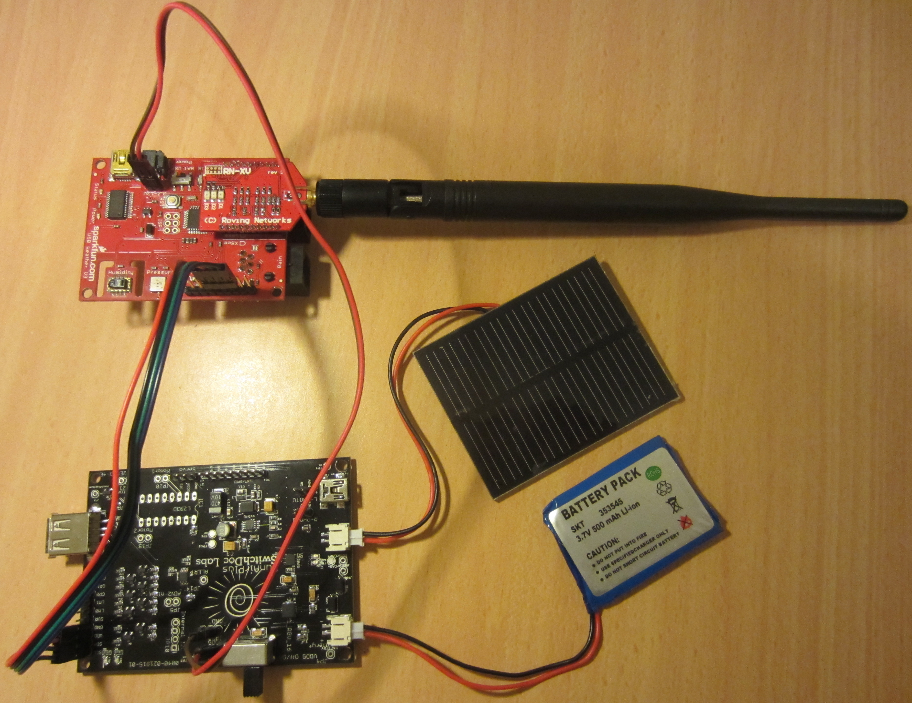

# MqttWiFlyWeatherBoard
Publish weather reports from a SparkFun Weather Board via a WiFly module to a MQTT broker

The file MqttWiFlyWeatherBoard.ino is the source code which can be loaded on to a [SparkFun Weather Board] (https://www.sparkfun.com/products/retired/10586) via the [Arduino IDE] (http://www.arduino.cc/en/Main/Software). The code takes a measurement from the local sensors (temperature, humidity, pressure and light) and also optional external wind and rain sensors, at 5 minute intervals. The measurements are then published via a WiFly module to a [Mosquitto MQTT broker] (http://mosquitto.org/) running on a Raspberry PI. For infomation about MQTT see http://mqtt.org/. Code is also included to enable the publishing of data from a [SunAirPlus Solar Power Controller/Data Collector] (http://www.switchdoc.com/sunairplus-solar-power-controllerdata-collector/) which is used to power the Weather Board via a LIPO battery and solar panel.

The source code is based on version 1.4 of the SparkFun Weather Board which is available from https://github.com/sparkfun/USB_Weather_Board/.

The Wifly-MQTT library from https://github.com/lagoudiana/Wifly-MQTT/tree/master/Arduino-wifly%20MQTT is used to provide the MQTT interface.

The library used to take measurements from the SunAirPlus INA3221 3 Channel Current / Voltage Monitor is available from https://github.com/switchdoclabs/SDL_Arduino_INA3221.

The configuration of the hardware I use is shown in the following figure. The red board in the top left is the Sparkfun Weather Board. The WiFly module is installed on the top right of the Weather Board, with the antenna the black object pointing to the right. The dark colour board at the bottom left is the SunAirPlus with a solar panel and LIPO battery connected. Note the battery and solar panels were only for testing purposes. When operating I use a 3000mAH LIPO battery and 1.5W solar panel.

Python code is included to publish the data from the weather station to external sites - at present [Twitter](http://twitter.com) and [Bom WoW](http://bom-wow.metoffice.gov.uk/).

The following modules are required to run the Python code:
* [ConfigObj](https://github.com/DiffSK/configobj)
* [Tweepy](https://github.com/tweepy/tweepy)
* [requests](https://github.com/kennethreitz/requests)
* [numericalunits](https://github.com/sbyrnes321/numericalunits)
* [MQTT](https://pypi.python.org/pypi/paho-mqtt)
* [schedule](https://github.com/dbader/schedule)

